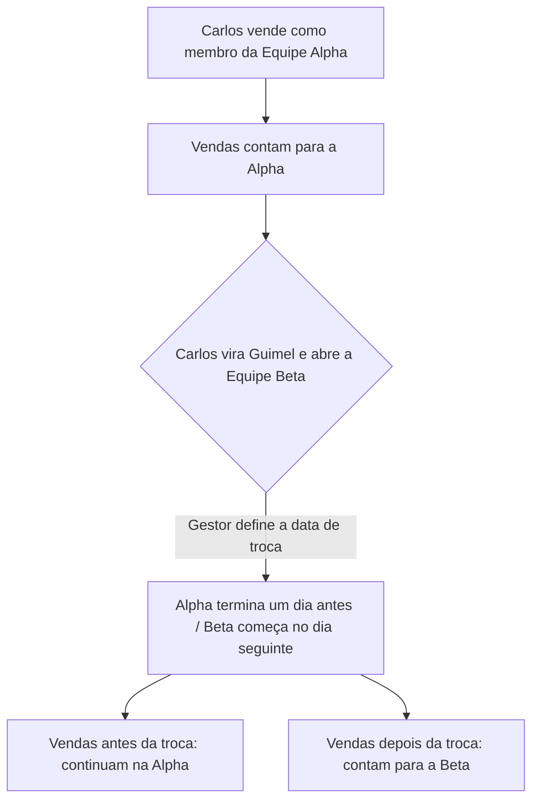

# Calendário de Equipes — Como Funciona

## Resumo em 30 segundos

- Antes: quando um consultor trocava de equipe, **todas** as vendas antigas dele iam junto para a nova equipe.
- Agora: as vendas **ficam onde foram feitas**. Se o consultor era da Equipe Alpha quando vendeu, essa venda continua sendo da Alpha — mesmo depois que ele for promovido e criar a Equipe Beta.
- O **Calendário de Equipes** é a tela onde você define a data exata dessa troca (a "data de corte").

---

## 1. Por que isso mudou

Até hoje, o sistema só olhava para a equipe **atual** do consultor: se ele abrisse uma equipe nova, todo o histórico de vendas ia junto, mesmo vendas feitas anos atrás em outra equipe.

Com o novo Plano de Carreira, isso deixou de fazer sentido: cada venda deve ficar registrada na equipe em que foi feita.

**Regra simples:**
- Vendeu enquanto estava na Equipe Alpha → conta para a Alpha, para sempre.
- A partir do dia em que virou Guimel e abriu a Equipe Beta → as vendas novas contam para a Beta.

---

## 2. Exemplo Prático

Vamos usar o consultor **Carlos**.

**O que aconteceu:**

| Data | Evento |
|---|---|
| 01/01/2026 | Carlos entra na Equipe Alpha |
| 20/08/2026 | Carlos fecha o Contrato nº 1001 (R$ 50.000) — ainda na Alpha |
| 25/08/2026 | Último dia de Carlos na Equipe Alpha |
| 26/08/2026 | Carlos vira Guimel e abre a Equipe Beta |
| 28/08/2026 | Carlos fecha o Contrato nº 1002 (R$ 80.000) — já na Beta |

**Resultado na tela de contratos:**

- O Contrato 1001 (20/08) → aparece só quando você filtra pela **Equipe Alpha**.
- O Contrato 1002 (28/08) → aparece só quando você filtra pela **Equipe Beta**.

Ou seja: **nada some, nada duplica.** Cada contrato fica exatamente na equipe em que foi vendido. O sistema só olha a data da venda e verifica: "em que equipe o Carlos estava nesse dia?".

---

## 3. As 3 regras que o sistema segue

1. **Nunca tem dois donos ao mesmo tempo.** Carlos nunca está em duas equipes no mesmo dia, e nunca fica um dia "sem equipe" — quando a Alpha termina, a Beta já começa no dia seguinte, sem furo.
2. **Todo período dura pelo menos 1 semana.** Isso evita trocas rápidas demais que bagunçariam os relatórios.
3. **O histórico nunca é apagado.** Se Carlos passar por Alpha → Beta → Gamma ao longo dos anos, todas as etapas continuam registradas.

---

## 4. Onde fazer isso no sistema

### Ver a linha do tempo de um consultor
Vá em **Equipes > Calendário** (`#/teams/calendar`). Você verá cada consultor com um "mapa" colorido mostrando por quais equipes ele passou e quando.

*[imagem: linha do tempo]*

### Mover um consultor para uma nova equipe (passo a passo)
Quando o consultor for promovido ou trocar de equipe, use o assistente:

1. **Escolha a nova equipe** de destino.
2. **Escolha a data da troca** — a partir de quando as vendas passam a contar para a nova equipe.
3. **Confira o preview**: o sistema mostra, lado a lado, quais contratos ficam na equipe antiga e quais vão para a nova — antes de você confirmar qualquer coisa.
4. **Confirme.** Pronto, a troca está registrada.

*[imagem: assistente e tabela de preview]*

### Errou a data? Dá para ajustar
Se a data de corte precisar mudar (por exemplo, de 26/08 para 20/08):

- Clique em **"Ajustar Transição"** (ou arraste a divisória na linha do tempo).
- O sistema mostra na hora quais contratos mudam de equipe com a nova data.
- Ao confirmar, tudo se reorganiza automaticamente — sem deixar buracos entre as equipes.

*[imagem: modal de ajuste com antes/depois]*

### Precisa corrigir só o início ou fim de um período?
Clique no card da equipe → **"Editar Datas"**. O sistema ajusta sozinho a equipe vizinha para não deixar sobreposição nem intervalo vazio.

*[imagem: modal de edição de datas]*

---

## 5. Fluxo em uma imagem

